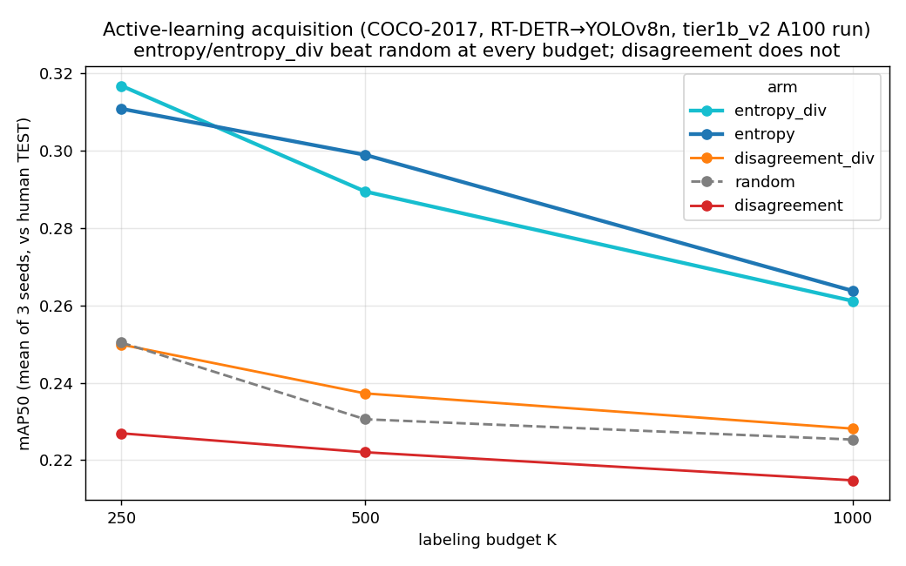

# Edge Detection Active Learning — An Honest Benchmark for Label-Efficient Object Detection

[](https://github.com/Rhutvik-pachghare1999/edge-detection-active-learning/actions/workflows/ci.yml)


**One-line problem:** Labeling data is the bottleneck when you retrain a small
object detector for the edge. Given a large unlabeled image pool and a tiny
labeling budget, *which images should you label to improve the model the most?*

This repo answers that question with a **rigorous, leakage-free benchmark** on
COCO-2017, comparing five data-selection ("acquisition") strategies. Every
number below is measured against **held-out human COCO labels**, never against
the teacher model's own guesses.

> **TL;DR finding:** Prediction-**entropy** sampling beats random selection at every budget tested by
> **+0.039 to +0.061 mAP50** (margin largest at small budgets). The intuitive
> **teacher-student disagreement** signal — the original hypothesis of this
> project — **does not beat random**. Combining entropy with k-center diversity
> (`entropy_div`) is the best arm at K=250 (0.317) but does not decisively beat
> plain entropy overall. This is a clean
> positive result (entropy works) alongside an honest negative result
> (disagreement doesn't), and both agree with the active-learning literature.

---

## The experiment

- **Pool / test split:** 4,000 COCO-2017 images to select from; **1,000 held-out
  images with human labels** used only for final evaluation. Splits are disjoint
  (verified in tests and on disk — no leakage).
- **Teacher:** RT-DETR (`PekingU/rtdetr_r50vd`) auto-labels the pool.
- **Student:** YOLOv8n, fine-tuned on the teacher's pseudo-labels for the K
  selected images, then evaluated on the human TEST set.
- **Budgets:** K ∈ {250, 500, 1000}, each over **3 seeds** (42/43/44).
- **Arms:**
  | arm | how it picks K images |
  |-----|-----------------------|
  | `random` | uniform baseline |
  | `entropy` | highest student prediction entropy (uncertainty) |
  | `disagreement` | highest teacher-student box/confidence disagreement |
  | `disagreement_div` | disagreement + k-center-greedy diversity |
  | `entropy_div` | entropy + k-center-greedy diversity |

Run on an **ASU SOL A100** node via SLURM (`sol/run_tier1b_v2.sbatch`).

## Results — mAP50 (mean of 3 seeds, vs human TEST labels)

Mean mAP50 over 3 seeds (42/43/44), evaluated against human COCO TEST labels.
These are the authoritative **tier1b_v2** results from the SOL A100 run
(`results/tier1b_v2/tier1b_v2_aggregated.json`, started 2026-09-05, 45 result
records; sha256 `3ef5acef…4191c93`).

| Arm | K=250 | K=500 | K=1000 | vs random |
|-----|------:|------:|-------:|----------:|
| **entropy_div** (entropy + k-center) | **0.317** | 0.290 | 0.261 | best at K=250 |
| **entropy** | 0.311 | **0.299** | **0.264** | +0.039 to +0.061 |
| disagreement_div | 0.250 | 0.237 | 0.228 | ~parity |
| random (baseline) | 0.250 | 0.231 | 0.225 | — |
| disagreement | 0.227 | 0.222 | 0.215 | at/below random |



### Findings

1. **Entropy sampling wins at every budget** — +0.061 (K=250), +0.068 (K=500),
   +0.039 (K=1000) mAP50 over random, well above the seed-to-seed std.
   A clean positive result.
2. **Teacher-student disagreement does not beat random.** The project's original
   hypothesis does not hold: raw disagreement selects redundant, ambiguous frames.
3. **Diversity + entropy (`entropy_div`) is the top arm at K=250** (0.317) and
   competitive elsewhere — diversity is worth combining with uncertainty, not
   with disagreement (`disagreement_div` only reaches ~parity with random).
4. **Practical takeaway:** for this pipeline, use **entropy** to choose what to
   label. Reserve disagreement for *flagging* failures, not *selecting* data.

### How the benchmark was made fair

Three protocol fixes (see `scripts/run_tier1_experiment.py`), each validated:

- **K-scaled training epochs** (`epochs_for_k`): the first run trained every
  budget for a flat 15 epochs, which badly undertrained large-K runs and made
  accuracy *fall* as data grew — an artifact, not a finding. Scaling epochs with
  K flattened it (random K=1000 went 0.106 → 0.225). *No TEST data is used for
  this; it depends only on the training-set size, so there is no leakage.*
- **Diversity-aware selection** (k-center-greedy on ResNet18 embeddings) so
  uncertainty arms stop picking near-duplicate frames.
- **Pseudo-label confidence floor** (0.5): ~45% of teacher boxes scored below
  0.5 (pure noise); dropping them cleans the training signal.

## How the literature frames this

- Uncertainty sampling (entropy / least-confidence / margin) is the classic,
  reliable active-learning family (Settles, *Active Learning Literature Survey*, 2009).
- Diversity matters — pick uncertain **and** varied samples (Sener & Savarese,
  *Core-set / k-Center*, 2018; Ash et al., *BADGE*, 2020).
- Teacher-student disagreement is central to knowledge distillation and
  auto-labeling "data engines," but is used to **flag** failures, not as the best
  **selection** signal — consistent with our negative result.

---

## Reproduce (< 30 min on a GPU, reusing cached teacher/student predictions)

```bash
python -m venv venv && source venv/bin/activate
pip install -r requirements.txt
python -m pytest tests/ -q          # 65 tests (+1 data-gated skip): integrity, leakage, acquisition, prep

# 1. Stage the fixed COCO subset (internet needed once)
python scripts/fetch_dataset.py --data-root data/coco2017 \
    --subset-name subset_4k --subset-size 5000 --train-size 4000

# 2. Run the benchmark (GPU strongly recommended)
python scripts/run_tier1_experiment.py \
    --data-root data/coco2017 --output-dir results/tier1b_v2 \
    --config configs/tier1b_v2.yaml \
    --base-model yolov8n.pt --student-onnx models/yolov8n.onnx --device cuda
```

Outputs: `results/tier1b_v2/tier1b_v2_aggregated.json` (mean±std per arm/K),
`tier1b_v2_map50.png` (the plot), and `tier1b_v2.log` (per-run source of truth).

## Repository layout

```
src/aecs_sdc/       benchmark package (acquisition, disagreement, dataset, tier1, ...)
scripts/            run_tier1_experiment.py, fetch_dataset.py, retrain_experiment.py
configs/            tier1b_v2.yaml (main sweep), probe.yaml, benchmark.yaml
tests/              65 tests + 1 data-gated skip across 11 files: dataset integrity, split leakage, acquisition, prep
sol/                A100 SLURM scripts + COMMANDS.md (cluster run recipe)
results/tier1b_v2/  aggregated JSON, mAP50 plot, per-run log
models/yolov8n.onnx committed student model
supervisor/         LEGACY live-hardware prototype (see note below) — not the benchmark
```

---

## Legacy prototype (not the benchmark — read this)

`supervisor/`, `isaac_bridge/`, `dashboard/`, `clips/`, and `PAPER_FINAL.txt` are
an earlier **live-hardware prototype** (Raspberry Pi student + laptop RT-DETR
teacher + WebSocket + dashboard). It runs and produced ~685 auto-labeled clips,
but its metrics are pseudo-ground-truth (teacher-as-truth) and the drone sensor
integration was not exercised (sensor values are zero in the stored data). **The
credible, human-label-evaluated result is the Tier-1B benchmark above.** Treat
the legacy path as an engineering demo, not as validated science, and note that
`PAPER_FINAL.txt` predates — and does not reflect — the honest benchmark findings.

## Security note

Rotate any credential that was ever committed to `.env`; use `.env.example` as
the template and keep real secrets out of the repo.
```
